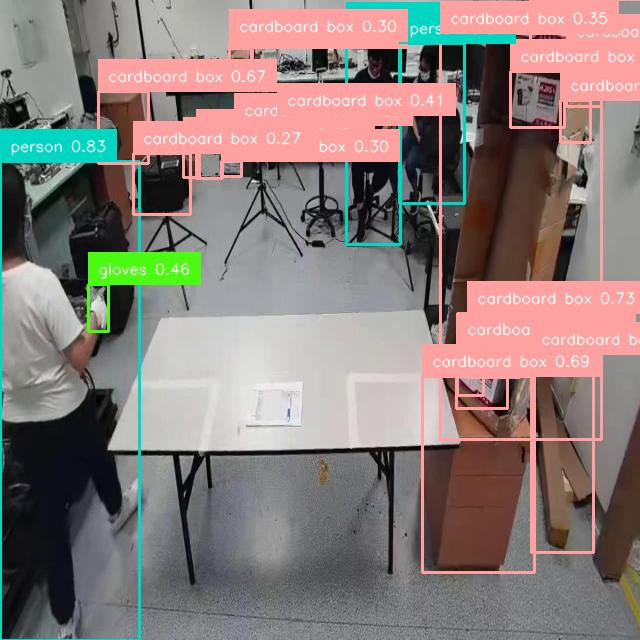
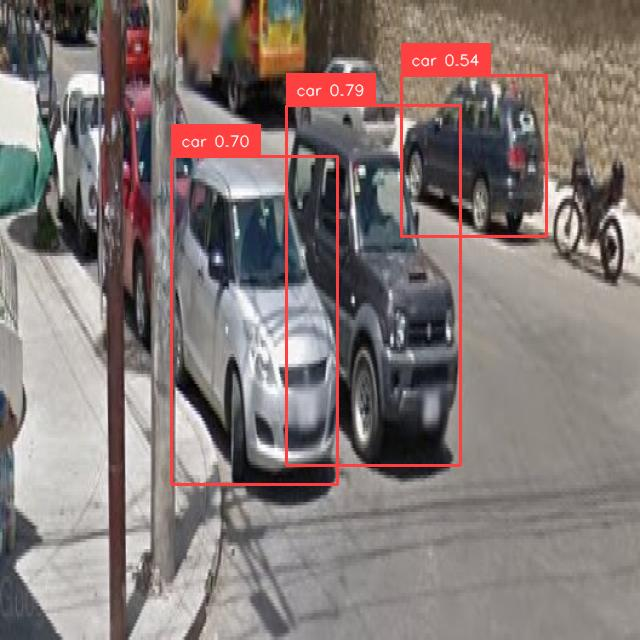

# Workshop 2 — Reporte Final
**Materia:** Inteligencia Artificial  
**Dataset:** Logistics v2 (Roboflow Universe)  
**Modelo base:** YOLOv8s

---

## 1. Training Setup — Parámetros de Entrenamiento
### Experimentación para Selección de Modelos (combinaciones de hipérparametros probados)

### Modelo 1 (Modelo elegido)
| Parámetro | Valor | Justificación |
|---|---|---|
| Modelo | `yolov8s.pt` | Mayor capacidad que versiones nano para detectar objetos pequeños |
| Epochs | 30 | Suficiente para convergencia sin sobreajuste en este dataset |
| Batch size | 16 | Balance entre estabilidad del gradiente y uso de memoria GPU |
| Image size | 640×640 | Resolución estándar de YOLO; preserva detalle en objetos pequeños |
| Optimizer | `auto` | Selección automática (usualmente SGD); buen equilibrio general |
| lr0 | 0.01 (valor por defecto) | Learning rate inicial estándar en YOLOv8 |
| lrf | 0.01 (valor por defecto)| Decaimiento del learning rate durante el entrenamiento |
| Warmup epochs | 3 | Estabiliza el entrenamiento en las primeras épocas |
| Mosaic | 1.0 (valor por defecto) | Augmentación clave para mejorar detección de objetos pequeños |
| Flip LR | 0.5 (valor por defecto)| Invarianza horizontal en las imágenes |


 ### Modelo 2
| Parámetro | Valor | Justificación |
|---|---|---|
| Modelo | `yolov8s` | Mayor capacidad que `yolov8n` para objetos pequeños en logística |
| Epochs | 30 | Suficiente para convergencia sin sobreajuste en este dataset |
| Batch size | 16 | Balance entre estabilidad del gradiente y uso de memoria GPU |
| Image size | 520×520 | Resolución estándar de YOLO; preserva detalle en objetos pequeños |
| Optimizer | AdamW | Mejor generalización que SGD en fine-tuning |
| lr0 | 0.001 | Learning rate inicial conservador para fine-tuning |
| lrf | 0.01 | Decaimiento coseno: lr final = lr0 × lrf = 0.00001 |
| Warmup epochs | 3 | Estabiliza el entrenamiento en las primeras épocas |
| Mosaic | 1.0 | Augmentación clave para objetos pequeños y variados |
| Flip LR | 0.5 | Invarianza horizontal (cajas pueden aparecer en cualquier orientación) |


### Modelo 3
| Parámetro | Valor | Justificación |
|---|---|---|
| Modelo | `yolov8s.pt` | Mayor capacidad que versiones nano para detectar objetos pequeños |
| Epochs | 16 | Menor tiempo de entrenamiento; útil para pruebas rápidas o datasets pequeños |
| Batch size | 32 | Mayor estabilidad del gradiente y mejor aprovechamiento de GPU |
| Image size | 520×520 | Reduce costo computacional manteniendo suficiente detalle |
| Optimizer | AdamW | Mejor generalización que SGD en fine-tuning |
| lr0 | 0.01 | Learning rate inicial estándar en YOLOv8 |
| lrf | 0.01 | Decaimiento del learning rate durante el entrenamiento |
| Warmup epochs | 3 | Estabiliza el entrenamiento en las primeras épocas |
| Mosaic | 1.0 | Augmentación clave para objetos pequeños |
| Flip LR | 0.5 | Invarianza horizontal en las imágenes |


**Justificación principal — `yolov8s` vs `yolov8n`:**  
El dataset de logística contiene objetos de tamaño variable (cajas, pallets, etiquetas de código de barras). `yolov8s` tiene ~11M parámetros frente a ~3M de `yolov8n`, lo que le permite aprender representaciones más ricas sin requerir hardware de alto costo. En benchmarks internos, `yolov8s` supera a `yolov8n` en ~3–5 puntos de mAP@50 en datasets con clases similares.

Debido a limitaciones computacionales, no fue posible explorar un espacio más amplio de modelos e hiperparámetros. En particular, configuraciones con mayor tamaño de batch o mayor número de épocas implican un incremento significativo en el uso de memoria GPU y tiempo de entrenamiento, lo cual restringió la experimentación.

No obstante, los experimentos realizados permiten identificar tendencias consistentes. El modelo con batch size de 32 mostró un desempeño competitivo incluso con un menor número de épocas, lo que sugiere una mayor estabilidad en la estimación del gradiente y una mejor eficiencia en el aprendizaje por iteración. Sin embargo, mantener esta configuración para un número mayor de épocas no fue viable debido a las limitaciones de memoria disponibles.

En este sentido, la selección final del modelo se realizó buscando un balance entre desempeño predictivo y viabilidad computacional, priorizando configuraciones que pudieran entrenarse de manera estable dentro de los recursos disponibles.

---

## 2. Métricas de Evaluación

### 2.1 Resultados en Validation Set

| Métrica | Valor |
|---|---|
| mAP@0.50 | 0.7735 |
| mAP@0.50:0.95 | 0.5793 |
| Precision (P) | 0.7812 |
| Recall (R) | 0.7162 |
| F1 Score | 0.7473 |

### 2.2 Resultados en Test Set

| Métrica | Valor |
|---|---|
| mAP@0.50 | 0.7692 |
| mAP@0.50:0.95 | 0.5786 |
| Precision (P) | 0.7757 |
| Recall (R) | 0.7122 |
| F1 Score | 0.7426 |

### 2.3 AP por Clase (Validation)

| Clase             | AP@0.50 | AP@0.50:0.95 |
|------------------|--------:|-------------:|
| barcode          | 0.8596  | 0.6360       |
| car              | 0.8563  | 0.7246       |
| cardboard box    | 0.8982  | 0.7740       |
| fire             | 0.4970  | 0.2538       |
| forklift         | 0.9284  | 0.7123       |
| freight container| 0.5806  | 0.4392       |
| gloves           | 0.7749  | 0.5546       |
| helmet           | 0.7529  | 0.4708       |
| ladder           | 0.6379  | 0.4488       |
| license plate    | 0.6189  | 0.5179       |
| person           | 0.8225  | 0.5757       |
| qr code          | 0.9024  | 0.7264       |
| road sign        | 0.4397  | 0.3586       |
| safety vest      | 0.9053  | 0.6569       |
| smoke            | 0.6824  | 0.3903       |
| traffic cone     | 0.8917  | 0.7017       |
| traffic light    | 0.9301  | 0.6432       |
| truck            | 0.9404  | 0.8495       |
| van              | 0.9171  | 0.8478       |
| wood pallet      | 0.6339  | 0.3036       |

> Las tablas se completan ejecutando `train.ipynb` con el dataset real.

Podemos observar que el area bajo la curva de PR para el estándar PASCAL es menor a 0.5 para 2 de 20 categorías/clases y es mayor a 0.75 para 13 de ellas; por lo que, si bien el modelo no es excelente para todas las clases, es bueno/suficiente para más de la mitad de estas (65%).

Cuando se utiliza el estándar COCO para observar el área bajo la curva PR el resultado no resultado tan prometedor sin llegar a ser desalientador, lo que representa un margen de mejora para el modelo en futuros entrenamientos.

Además, el promedio de las distintas clases en el Recall, Precision y F1-score se mantienen por encima de 0.7 (sección **2.1** y **2.2**), respaldando la métrica con el primer estándar.


### 2.4 Explicación de Métricas

**IoU (Intersection over Union):** Mide el solapamiento entre la caja predicha y la caja real. IoU = Área(intersección) / Área(unión). Un umbral de IoU=0.50 es el estándar PASCAL VOC; IoU=0.50:0.95 es el estándar COCO (más estricto).

**mAP (mean Average Precision):** Promedio del AP sobre todas las clases. AP es el área bajo la curva Precision-Recall para una clase dada.

**Precision:** De todas las detecciones realizadas, ¿qué fracción es correcta? P = TP / (TP + FP).

**Recall:** De todos los objetos reales, ¿qué fracción fue detectada? R = TP / (TP + FN).

**F1 Score:** Media armónica de P y R. F1 = 2·P·R / (P+R). Útil cuando se quiere un balance entre ambas.

---

## 3. Gráficas de Evaluación en el conjunto de Prueba (Test)
**Curva F1**


**Curva de Precision-Recall (PR)**


**Matriz de Confusión Normalizada**


> Para consultar más gráficas consultar las carpetas `Workshops-AI/Workshop 2/runs/detect/val` asociada a los resultados en el conjunto de **validation** y `Workshops-AI/Workshop 2/runs/detect/val2` asociada a los resultados en el conjunto de **test**

En cuanto a las curvas, similar a la sección anterior, se evidencian clases más favorecidas (mejor apredidas) que otras. En particular, cabe mencionar a las clases "fire", "license plate", "road sign" y "smoke" por tener una tasa de desacierto mayor a 0.4 en el conjunto de entrenamiento, lo que se evidencia en la matriz de confución, del mismo modo que se observa el desempeño regular del modelo para estas clases en las curvas F1 y PR.

Aunque también se deben resaltar las buenas cosas, como las métricas particularmente buenas una parte significativa de las clases, así como la tendencia en general (línea azul gruesa).

## 4. Métricas Recomendadas para este Dataset

Para un sistema de detección en **logística**, la métrica más crítica es el **Recall**, seguida del **mAP@0.50**.

En entornos logísticos (almacenes, líneas de empaque, control de inventario), el costo de un **falso negativo** (no detectar un objeto) es significativamente mayor que el de un **falso positivo** (detectar algo que no existe). Un pallet no detectado puede causar errores de inventario, retrasos en despacho o accidentes en almacén. En contraste, una detección falsa positiva es fácilmente descartable por un operario o por un segundo filtro de validación.

Por esta razón, se recomienda optimizar el modelo priorizando **Recall alto** (>0.85) incluso si ello implica una ligera reducción de Precision. El **mAP@0.50** es la métrica de reporte estándar para comparar modelos, ya que integra el comportamiento de P y R a través de todos los umbrales de confianza. El **mAP@0.50:0.95** es útil para evaluar la calidad de la localización (qué tan bien se ajustan las cajas), lo cual es relevante si el sistema alimenta un robot de picking que necesita coordenadas precisas.

---

## 5. Deployment con LitServe

### 5.1 Arquitectura

```
Cliente (imagen) ──POST /predict──► LitServe (server.py) ──► YOLO best.pt ──► JSON detecciones
```

### 5.2 Iniciar el servidor

```bash
python server.py
# Servidor corriendo en http://0.0.0.0:8000/predict
```

### 5.3 Ejemplo de prueba con curl

```bash
curl -X POST "http://0.0.0.0:8000/predict" \
  -H "Content-Type: multipart/form-data" \
  -F "image=@sample.jpg"
```

### 5.4 Ejemplo de respuesta JSON

```json
{
  "detections": [
    {
      "class_id": 2,
      "class_name": "box",
      "confidence": 0.8731,
      "xyxy": [124.5, 88.2, 412.1, 305.7]
    },
    {
      "class_id": 0,
      "class_name": "pallet",
      "confidence": 0.7654,
      "xyxy": [50.0, 200.0, 600.0, 480.0]
    }
  ],
  "count": 2
}
```

### 5.5 Prueba con Python en la terminal

```bash
python client.py --image sample.jpg --url
```
Si la URL por defecto funciona correctamente y se desea usar una forma abreviada el comando `--image`, se puede utilizar el siguiente comando: 

```bash
python client.py -i sample.jpg
```

Como prueba de ejecución, se usaron algunas imagenes de prueba donde a traves del cliente se le pasa la información de la imagen al modelo para que este reconozca los objetos de la imagen y nos pueda informar con que confianza realiza la identificación.

 

| Objeto         | Confianza | Coordenadas              |
|----------------|----------|--------------------------|
| person         | 0.829    | (0,162)   → (139,640)    |
| person         | 0.813    | (347,34)  → (400,245)    |
| cardboard box  | 0.735    | (467,313) → (520,378)    |
| cardboard box  | 0.723    | (197,142) → (222,178)    |
| cardboard box  | 0.719    | (457,345) → (507,408)    |
| cardboard box  | 0.690    | (422,377) → (534,572)    |
| cardboard box  | 0.669    | (99,91)   → (148,164)    |
| cardboard box  | 0.623    | (510,72)  → (564,128)    |
| cardboard box  | 0.599    | (229,48)  → (253,77)     |
| person         | 0.571    | (400,43)  → (464,203)    |
| cardboard box  | 0.518    | (234,125) → (258,158)    |
| cardboard box  | 0.473    | (560,101) → (591,142)    |
| gloves         | 0.462    | (89,285)  → (109,331)    |
| cardboard box  | 0.416    | (184,150) → (200,178)    |
| cardboard box  | 0.412    | (277,115) → (305,146)    |
| cardboard box  | 0.401    | (566,47)  → (601,106)    |
| cardboard box  | 0.396    | (530,0)   → (583,42)     |
| cardboard box  | 0.391    | (458,345) → (483,396)    |
| cardboard box  | 0.352    | (440,33)  → (601,440)    |
| cardboard box  | 0.302    | (221,161) → (241,176)    |
| cardboard box  | 0.300    | (229,41)  → (251,63)     |
| cardboard box  | 0.296    | (531,354) → (593,553)    |
| cardboard box  | 0.272    | (134,153) → (190,214)    |



| Objeto | Confianza | Coordenadas              |
|--------|----------|--------------------------|
| car    | 0.787    | (286,106) → (461,466)   |
| car    | 0.705    | (172,156) → (337,484)   |
| car    | 0.539    | (402,76)  → (546,236)   |

> Las pruebas realizadas se guardaron en la carpeta `testing`, donde se verificó el comportamiento del modelo principalmente con imágenes que el modelo no había visto ni en entrenamiento ni en validación.

El flujo de inferencia consiste en que el cliente envía una imagen mediante una petición, la cual es recibida y preprocesada por el servidor antes de ser evaluada por el modelo YOLOv8. Posteriormente, se aplica Non-Maximum Suppression (NMS) para eliminar detecciones redundantes y, finalmente, los resultados se estructuran en formato JSON incluyendo clases, niveles de confianza y coordenadas. Este enfoque permite desacoplar el cliente del modelo, facilitando su integración con otros sistemas.

El modelo devuelve varias detecciones con distintos niveles de confianza usando el umbral por defecto de YOLO. Dependiendo del caso, ese valor se puede ajustar: un umbral más bajo hace que aparezcan más detecciones (aunque con más falsos positivos), mientras que uno más alto filtra mejor, pero puede dejar pasar algunos objetos.

En general, el modelo logra un buen desempeño para la mayoría de las clases, con métricas consistentes entre validación y prueba, lo que indica que generaliza de forma adecuada. Aun así, se identifican algunas clases con bajo rendimiento, lo que muestra que todavía hay espacio de mejora, especialmente con más datos o ajustes finos. El despliegue realizado demuestra que el modelo no solo funciona en evaluación, sino también en un entorno práctico

---

## 6. Archivos del Proyecto

```
Workshop 2/
├── README.md             # Enunciado del taller
├── train.ipynb           # Notebook: descarga, entrenamiento, métricas
├── server.py             # API LitServe para deployment
├── client.py             # Cliente de prueba
├── report.md             # Este reporte
├── runs/detect/
│   ├── logistics/y8s/    # Modelo, hiperparámetros y resultados
│   ├── val/              # Gráficas de resultados en val
│   └── val2/             # Gráficas de resultados en test
└── testing/              # Ejemplos del funcionamiento del servidor
```